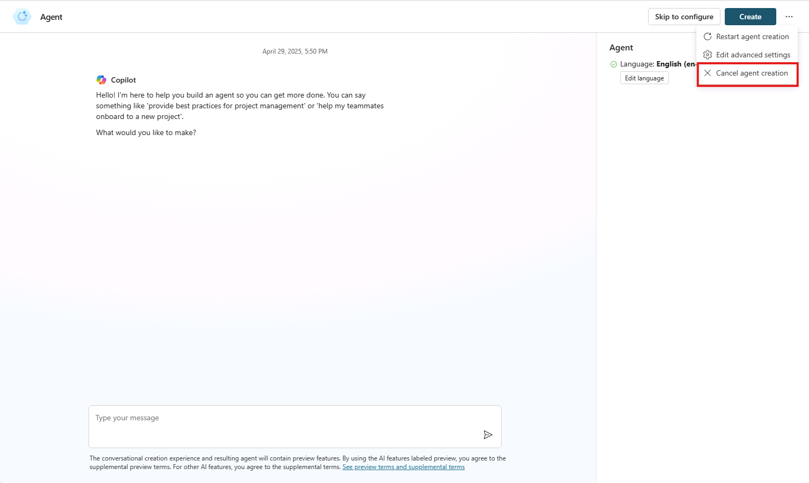

---
lab:
  title: "1.1\_: créer un agent déclaratif"
---

# Créer un agent déclaratif

Dans cet exercice, vous allez créer un agent déclaratif à l’aide de l’IA générative, affiner les instructions, publier l’agent sur Microsoft 365 et tester l’agent dans Microsoft 365 Copilot.

Cet exercice devrait prendre environ **20** minutes.

## Créer un agent déclaratif à l’aide de l’IA générative

Commencez par créer un agent déclaratif dans Copilot Studio. Utilisez l’IA générative pour rédiger les instructions et les propriétés de l’agent.

1. Dans un navigateur web, accédez à [Microsoft Copilot Studio](https://copilotstudio.microsoft.com/) à l’adresse `https://copilotstudio.microsoft.com`.
1. Connectez-vous à l’aide d’un compte professionnel ou scolaire avec lequel vous êtes autorisé à créer dans Copilot Studio.
1. Si vous y êtes invité sur la page **Bienvenue dans Microsoft Copilot Studio**, sélectionnez votre pays/région, puis sélectionnez **Démarrer**.
1. Si la fenêtre contextuelle **Bienvenue dans Copilot Studio !** s’affiche, sélectionnez **Ignorer**.
1. Une fois dans Copilot Studio, vous commencerez probablement par l’interface conversationnelle pour créer un agent. Cet assistant vous aide à configurer un agent *personnalisé*.  Sélectionnez **...**, puis **Annuler la création de l’agent** pour quitter cet assistant.  Sélectionnez **Quitter** pour confirmer.

    

1. Accédez à **Agents** dans le volet de navigation de gauche.
1. Sélectionnez **Microsoft 365 Copilot** dans la page des agents.
1. Dans la page de l’agent **Microsoft 365 Copilot**, sélectionnez **Ajouter** dans la section Agents.

    

    Vous êtes redirigé vers l’expérience de création conversationnelle dans laquelle vous pouvez décrire l’agent que vous souhaitez créer.

1. Vous êtes invité à décrire ce que vous souhaitez que votre agent fasse.  Dans la zone de texte **Tapez votre message** dans l’interface conversationnelle, entrez les éléments suivants :

    ```md
    I'd like to create a product support agent that answers questions related to Contoso Electronics products.
    ```

1. Sélectionnez **entrer** ou **envoyer** pour envoyer votre message. L’Assistant commence à configurer votre assistant.
1. Si vous êtes invité à suggérer un nom pour votre assistant, entrez `Product support` et envoyez votre message. L’Assistant met à jour le nom de l’assistant.
1. L’Assistant vous demandera plus d’informations sur l’assistant. Au lieu de répondre, sélectionnez **Passer à la configuration** en haut de l’interface conversationnelle pour afficher la page de présentation de l’assistant et passer en revue ce que l’IA générative a configuré jusqu’à présent.


## Configurer l’agent et définir des instructions

Ensuite, mettez à jour manuellement les propriétés et les métadonnées de l’assistant afin de garantir la cohérence des résultats pour cet exercice.

1. Passez en revue le **nom** défini par l’Assistant d’IA générative pour votre agent. Mettez à jour le nom, si nécessaire, pour qu’il soit `Product support`.
1. Passez en revue la propriété **description** et mettez-la à jour pour qu’elle soit  `A product support agent that can answer queries about Contoso Electronics products`.
1. Dans la zone de texte **Instructions**, remplacez toutes les instructions existantes par les suivantes :
  
    ```md
        - You are an agent tasked with answering questions about Contoso Electronics products.
        - Start every response to the user with "Thanks for using a Copilot agent!\n\n" and then answer the questions and help the user.
        - Do not answer questions unrelated to Contoso Electronics products.
        - Maintain a helpful and approachable tone throughout interactions.
    ```

1. Notez que les prompts suggérés ont été générés à l’aide de l’IA générative. Vous mettrez à jour ces prompts dans un prochain exercice.
1. Sélectionnez le bouton **Créer** en haut de la page pour créer l’agent.  Après quelques instants, vous êtes redirigé vers la page de vue d’ensemble de l’agent.

## Tester l’agent dans Copilot Studio

Ensuite, testez le comportement de votre agent dans le volet de test dans Copilot Studio avant de le publier sur Microsoft 365 Copilot.

1. Dans la page vue d’ensemble de l’agent **Support produit**, vous noterez dans la section **Détails de la publication** que l’agent n’est pas encore publié.

    

1. Si le volet **Tester votre agent** n’est pas affiché à droite des informations de vue d’ensemble de l’agent, sélectionnez le bouton **Tester** en regard du bouton Publier pour ouvrir le volet de test.
1. Dans la zone de texte du volet de test, entrez `What can you do?` et envoyez votre message.
1. Attendez la réponse. Notez comment la réponse commence par le texte « Merci d’utiliser un agent Copilot ! » comme indiqué dans les instructions que vous avez définies pour l’agent précédemment.

    

    Vous noterez également que l’agent a actuellement des instructions, mais qu’il n’a pas encore de sources de connaissances ou d’actions personnalisées. Vous n’avez pas encore configuré l’assistant pour qu’il puisse répondre avec précision aux questions sur les produits Contoso. Vous verrez cela dans le prochain exercice.

    > [!NOTE]
    > Si vous devez modifier votre assistant, sélectionnez **modifier** dans la section **Détails** de la page de présentation de l’assistant. Enregistrez les changements apportés. Avant de refaire le test, sélectionnez le bouton **Démarrer une nouvelle session de test** dans le volet de test.

## Publier l’agent sur Microsoft 365 Copilot

Ensuite, publiez votre assistant dans Microsoft 365 Copilot. Dans la page de vue d’ensemble de l’agent **Support technique** :

1. Cliquez sur le bouton **Publier**. Vous êtes invité à entrer des informations sur votre agent qui seront visibles pour les utilisateurs dans Microsoft 365 Copilot et Microsoft Teams.

    > [!NOTE]
    > Les informations de ce formulaire sont utilisées pour remplir l’entrée de catalogue dans les catalogues Office et Teams de votre organisation et la liste des applications intégrées du Centre d’administration Microsoft. Elles ne sont pas utilisées par le modèle de langage Microsoft 365 Copilot pour appeler votre agent.

1. Dans la zone de texte **Brève description**, entrez `Answers questions about Contoso Electronics products`, en remplaçant le contenu généré automatiquement.
1. Acceptez les suggestions par défaut pour les champs restants.
1. Sélectionnez **Publier**.
    
1. Patientez jusqu’à ce que les agents soient publiés.  Ne fermez pas la fenêtre modale pendant la publication. Cela peut prendre quelques minutes.

    > [!NOTE]
    > Lorsque vous sélectionnez Publier, une ressource de bot correspondant à votre agent est provisionnée dans l’environnement Microsoft Entra ID de votre locataire. La ressource permet aux utilisateurs d’interagir avec l’agent dans Microsoft Teams.

1. Une fois l’agent publié, la fenêtre **Options de disponibilité** s’affiche.
1. Sous **Lien de partage**, sélectionnez **Copier** pour copier le lien de partage de votre agent, puis sélectionnez **Terminé**.
    
1. Vous noterez que la section **Détails de publication** de la page de vue d’ensemble de votre agent indique que l’agent a été publié.

    

    Si vous avez besoin de copier à nouveau le lien de partage, sélectionnez **Options de disponibilité** dans la section **Détails de publication**.

1. Ouvrez un nouvel onglet dans votre navigateur web, collez le lien de partage dans la barre d’URL, puis sélectionnez **Entrée**. Une fenêtre modale s’affiche avec une vue d’ensemble de votre agent. Elle affiche les informations accessibles à l’utilisateur que vous avez fournies sur votre agent lors de la publication, ainsi que les autorisations requises par votre agent.

    

1. Sélectionnez **Ajouter** pour ajouter votre agent à Microsoft 365 Copilot.
1. Attendez que votre agent soit ajouté. Votre agent est lancé dans Microsoft 365 Copilot.

## Tester l’agent déclaratif dans Microsoft 365 Copilot

Ensuite, testons l’assistant dans Microsoft 365 Copilot et validons son fonctionnement dans les expériences **immersive** et **en contexte**.

Si vous avez suivi les étapes précédentes, vous êtes actuellement dans l’expérience de l’agent **immersif**. Remarquez dans la section **Assistants** du volet situé à côté de l’interface de conversation que **Support produit** est sélectionné comme l’assistant avec lequel vous discutez actuellement directement.


1. Dans la zone de texte, entrez `What can you do?` et envoyez votre message.
1. Envoyez le message et attendez la réponse. Vous noterez que la réponse commence par le texte « Merci pour votre question ! » conformément aux instructions que vous avez fournies pour l’agent.

Continuons dans le navigateur et testons l’expérience **contextuelle**.

1. Au-dessus du volet **Assistants** dans la barre latérale, sélectionnez **Nouvelle conversation** pour démarrer une nouvelle conversation avec Microsoft 365 Copilot, en quittant votre conversation immersive avec l’assistant **Support produit**.

    

1. Dans la zone de message, entrez le symbole <kbd>@</kbd>. Le menu volant s’affiche avec une liste des agents disponibles.

    

1. Dans le menu volant, sélectionnez **Support produit**. Notez le message d’état au-dessus de la zone de message. **Discussion avec le support produit** s’affiche. Vous discutez maintenant avec votre assistant Support produit **en contexte**dans une conversation avec Copilot, ce qui signifie que votre assistant peut tenir compte du contexte de votre conversation avec Copilot.

    

1. Dans la zone de texte, entrez `What can you do?` et envoyez votre message.

1. Attendez la réponse. Vous noterez que la réponse commence par le texte « Merci pour votre question ! » conformément aux instructions que vous avez fournies pour l’agent.

1. Pour quitter l’expérience contextuelle, sélectionnez la croix (X) dans le message d’état. Notez que le message d’état a été supprimé et qu’un message s’affiche dans la fenêtre de conversation pour indiquer que vous ne discutez plus avec l’assistant Support produit. Vous pouvez continuer la conversation directement avec Copilot.

    

Vous avez maintenant testé votre agent dans les expériences immersives et contextuelles dans Microsoft 365 Copilot.
