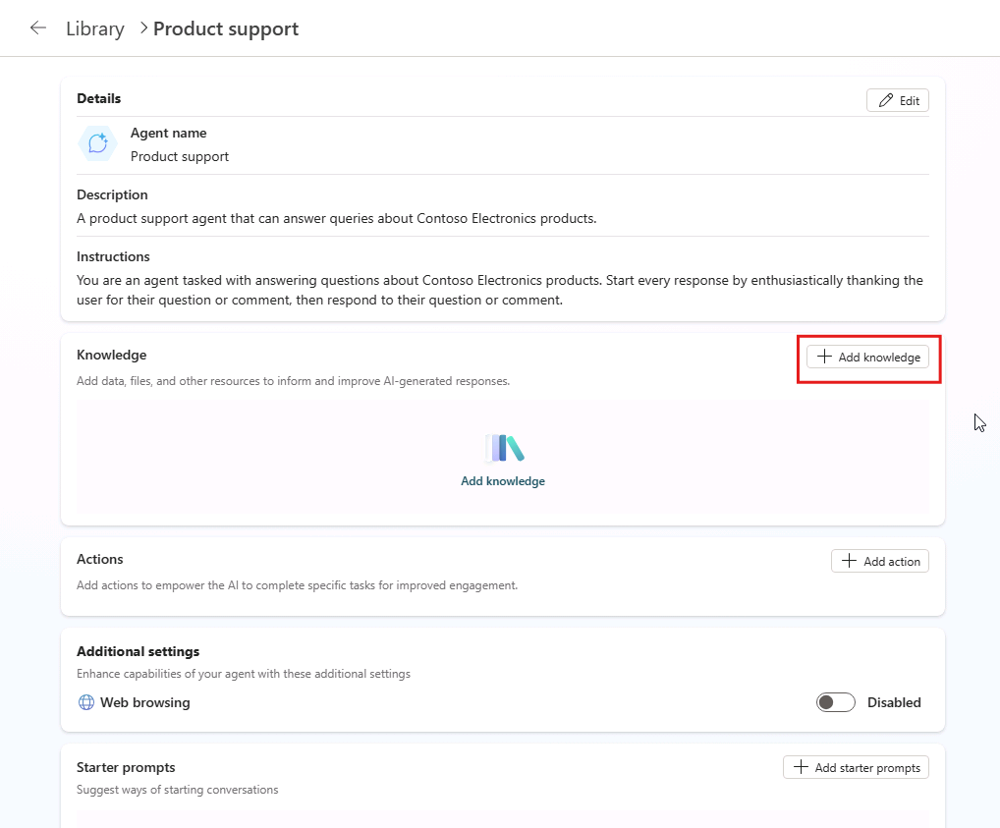

---
lab:
  title: "1.2\_: ajouter des connaissances personnalisées"
---

# Ajouter des connaissances personnalisées

Dans cet exercice, vous allez mettre à jour l’agent déclaratif que vous avez créé dans l’exercice précédent avec des instructions personnalisées et des données d’ancrage. Cet exercice suppose que vous disposez d’un site SharePoint avec une bibliothèque de documents nommée « Produits » qui contient des exemples de fichiers de produit.

Cet exercice devrait prendre environ **20** minutes.

## Avant de commencer

Avant de commencer cet exercice, vous devez charger les documents liés au produit dans Microsoft 365, que l’agent déclaratif utilisera comme données d’ancrage. Effectuez les étapes ci-dessous pour préparer l’exercice.

> [!NOTE]
> Lorsque vous chargez des documents sur un nouveau site SharePoint Online, il y a un délai avant que les documents ne soient indexés et disponibles pour une utilisation par Copilot. Si vous souhaitez tester votre agent immédiatement, chargez les documents sur un site **existant**. Les documents seront indexés et disponibles pour une utilisation par l’agent sans délai. Si vous choisissez d’utiliser un nouveau site SharePoint Online, les documents peuvent prendre plus de temps pour être indexés et disponibles pour une utilisation par Copilot.
>
> **Les instructions ci-dessous vous guident tout au long du chargement des documents sur un nouveau site**. Si vous souhaitez utiliser un site existant, commencez par la section intitulée **Charger des exemples de données** et utilisez votre bibliothèque existante à la place de la bibliothèque **Produits**.

### Télécharger les exemples de données

1. Dans un navigateur web, accédez au [dépôt GitHub](https://github.com/MicrosoftLearning/MS-4022-Extend-Microsoft-365-Copilot-in-Copilot-Studio/blob/master/Allfiles/Products.zip) du cours.
1. Sélectionnez le bouton **Télécharger le fichier brut** pour télécharger **Products.zip**.

    :::image type="content" source="../media/download-github.png" alt-text="Capture d’écran de Microsoft Edge mettant en évidence le bouton Télécharger le fichier brut dans GitHub.":::

1. **Ouvrez** le dossier téléchargé et **extrayez tout** le contenu dans un nouveau dossier sur votre ordinateur nommé `Products` auquel vous pourrez accéder ultérieurement.

### Créer un site SharePoint

1. Dans un navigateur web, accédez à [https://www.microsoft365.com](https://www.microsoft365.com) et **connectez-vous** à l’aide du compte Microsoft 365 que vous utilisez pour ce labo.
1. Dans le menu de gauche, sélectionnez **Applications** (icône de grille), puis sélectionnez **SharePoint** dans le catalogue d’applications.
1. Dans le menu de gauche, sélectionnez **Créer** (icône plus), puis sélectionnez **Site**.
1. Sélectionnez **Site de l’équipe** comme type de site.
1. Sur la page **Sélectionner un modèle**, sélectionnez **Équipe standard**.
1. Sur la page **Aperçu**, sélectionnez **Utiliser le modèle**.
1. Sur la page **Donner un nom à votre site**, entrez `Product support`, puis sélectionnez **Suivant**.
1. Sur la page de configuration suivante, réglez les **paramètres de confidentialité** sur **Public**.
1. Sélectionnez **Créer un site**. La création du site prend quelques instants et le bouton **Terminer** s’active.
1. Sélectionnez **Terminer**.

### Créer une bibliothèque de documents

1. Dans le site SharePoint **Support technique**, sélectionnez le bouton **Nouveau** en haut de la page, puis sélectionnez **Bibliothèque de documents**.
1. Dans la page **Créer une bibliothèque de documents**, sélectionnez **Bibliothèque vide**.
1. Dans le champ **Nom**, entrez `Products` et sélectionnez **Créer**.

### Charger l’exemple de données

1. Dans la bibliothèque **Produits**, sélectionnez le bouton **Charger**, puis sélectionnez **Fichiers**.
1. Accédez au dossier sur votre ordinateur où vous avez enregistré les exemples de fichiers dans une étape antérieure.
1. **Sélectionnez tous** les fichiers de votre dossier Produits local, puis sélectionnez **Ouvrir** pour les charger dans SharePoint.
1. Attendez la fin du chargement. Les fichiers apparaissent désormais dans la bibliothèque **Produits** dans SharePoint.

### Copier l’URL SharePoint

Ensuite, copiez l’URL directe vers le site pour l’utiliser lors de la configuration des connaissances de votre agent.

1. Sur la page de la bibliothèque **Produits** dans SharePoint, sélectionnez l’icône **Paramètres** en haut à droite, puis choisissez **Paramètres de la bibliothèque**, puis **Autres paramètres de bibliothèque**.

    :::image type="content" source="../media/sharepoint-library-settings.png" alt-text="Capture d’écran de Microsoft Edge montrant l’option Paramètres de la bibliothèque dans le menu Paramètres.":::

1. Recherchez la propriété **Adresse web**. Votre **URL de site SharePoint** est la partie de l’adresse web au format `https://DOMAIN.sharepoint.com/sites/SITE_NAME/LIBRARY_NAME`. Votre URL doit être `https://DOMAIN.sharepoint.com/sites/ProductSupport/Products`.
1. **Copiez** votre URL de site SharePoint et enregistrez-la pour l’utiliser dans les prochaines étapes du labo.

## Configurer votre agent avec des connaissances personnalisées

Ajoutez l’URL SharePoint à votre agent comme source de connaissances d’ancrage.

### Ajouter une URL SharePoint

1. Dans la page de vue d’ensemble de votre agent Support produit dans Copilot Studio, sélectionnez **Ajouter des connaissances** dans la section **Connaissances**.

    

2. Sur la page **Ajouter une connaissance** de l’Assistant qui s’ouvre, sélectionnez **SharePoint**.
3. Dans la zone de texte, collez l’URL de votre bibliothèque SharePoint **Produits**, puis sélectionnez **Ajouter**. L’URL doit se présenter sous la forme `https://DOMAIN.sharepoint.com/sites/ProductSupport/Products`.

4. Sélectionnez **Ajouter** dans la fenêtre **Ajouter SharePoint**, puis attendez que la source de connaissances soit ajoutée à l’agent. Cela peut prendre une à deux minutes.
5. Vous noterez que la bibliothèque **Produits** est répertoriée sous la section **Connaissances** des informations de vue d’ensemble de l’agent.

> **Remarque** : les agents Copilot Studio accèdent aux documents pour le compte de l’utilisateur. Votre agent pourra uniquement obtenir des réponses et du contenu à partir de documents auxquels vos utilisateurs finaux ont accès.

### Mettre à jour les instructions personnalisées

Ensuite, mettez à jour les instructions de l’agent pour décrire comment il doit utiliser la source de connaissances.

1. Sur la page de vue d’ensemble de l’agent dans Copilot Studio, sélectionnez **Modifier** dans la section **Détails**.
1. Mettez à jour le contenu de la zone de texte **Instructions** en procédant comme suit : `You are an agent tasked with answering questions about Contoso Electronics products. Start every response by enthusiastically thanking the user for their question or comment, then respond to their question or comment. You will use documents from the Products folder in SharePoint as your source of information. If you can't find the necessary information, you should suggest that the agent should reach out to the team responsible for further assistance. Your responses should be concise and always include a cited source.`
1. Sélectionnez **Enregistrer** dans la section **Détails**.

## Tester votre agent dans Copilot Studio

Enfin, testez la capacité de votre agent à utiliser la source de connaissances personnalisée.

1. À partir du volet **Tester votre agent** dans la page de vue d’ensemble de votre agent dans Copilot Studio, sélectionnez le bouton **Actualiser** pour actualiser le volet de test et charger les dernières modifications de votre agent.
1. Dans la zone de texte de la conversation test, entrez `Tell me about Eagle Air`, puis envoyez le message.
1. Attendez la réponse. Notez que la réponse contient des informations sur le drone Eagle Air. La réponse contient des citations et des références au document Eagle Air stocké sur SharePoint.

Essayons quelques invites supplémentaires :

1. Dans la zone de message, entrez `Recommend a product suitable for a farmer`, puis envoyez le message.
1. Attendez la réponse. Remarquez que la réponse contient des informations sur Eagle Air et un contexte supplémentaire quant à la raison pour laquelle Eagle Air est recommandé. La réponse contient des citations et des références au document Eagle Air stocké sur OneDrive.
1. Dans la zone de message, entrez `Explain why the Eagle Air is more suitable than Contoso Quad`, puis envoyez le message.
1. Attendez la réponse. Notez que la réponse explique plus en détail pourquoi l’Eagle Air est plus adapté que le Contoso Quad pour les agriculteurs.

Pour finir, testons la réponse de secours en posant une question à laquelle l’agent ne peut pas répondre :

1. Dans la zone de message, entrez `When was Mark8 released?`, puis envoyez le message.
1. Attendez la réponse. Vous noterez que la réponse suggère que l’agent doit contacter l’équipe responsable de l’assistance supplémentaire, comme indiqué dans les instructions.
