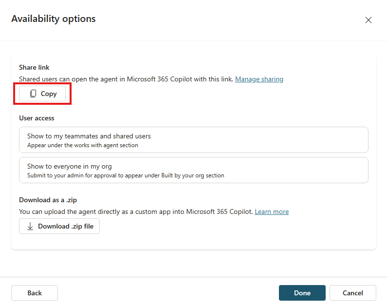

---
lab:
  title: "1.3\_: Ajouter des prompts suggérés"
---

# Ajouter des invites suggérées

Dans cet exercice, vous allez mettre à jour l’assistant déclaratif que vous avez créé dans l’exercice précédent avec six prompts suggérés appropriés.

Vous devriez terminer cet exercice en **10** minutes environ.

## Définir des invites suggérées

Dans Copilot Studio :

1. Accédez à la page **Vue d’ensemble** de votre agent **Support technique**.
1. Notez que l’assistant conversationnel généré par l’Assistant de création a créé des prompts suggérés pour votre assistant lors de sa création. Remplaçons-les par des prompts plus adaptés aux capacités de l’assistant.
1. Dans la section **Prompts suggérés**, sélectionnez l’icône **Modifier**.
1. Remplacez les prompts existants par les suivants :

      `Eagle Air` : `Tell me about Eagle Air`

      `Return policy` : `What is the returns policy`              

      `Product information` : `Can you provide information on a specific product?` 

      `Product troubleshooting` : `I'm having trouble with a product. Can you help me troubleshoot the issue?` 

      `Repair information ` : `Can you provide information on how to get a product repaired?`
      
      `Contact support` : `How can I contact support for help?`

1. Cliquez sur **Enregistrer** pour enregistrer vos modifications. 

## Publier à nouveau votre agent

Nous allons publier l’agent mis à jour sur Microsoft 365 Copilot.

1. Une fois les modifications de votre assistant enregistrées, sélectionnez **Publier** en haut à droite de la page de présentation de votre assistant dans Copilot Studio.
1. Dans la fenêtre modale qui s’ouvre, sélectionnez **Publier**.
1. Dans la fenêtre **Options de disponibilité** qui s’ouvre, sélectionnez **Copier** sous l’en-tête **Lien de partage**.
    
1. Dans un autre onglet de votre navigateur web, **collez** le lien de partage de votre agent, puis sélectionnez **Entrée**. Une fenêtre s’affiche décrivant l’agent **Support technique**.
1. Sélectionnez **Mettre à jour maintenant** sous le nom de l’agent pour publier les modifications apportées à l’agent Support produit. Patientez quelques instants pendant la mise à jour de l’agent.
1. Une fois la mise à jour terminée, fermez la fenêtre modale. Si vous n’êtes pas redirigé vers Microsoft 365 Copilot dans votre navigateur, sélectionnez **Copilot** dans le menu de gauche ou dans le menu **Applications** du portail Microsoft 365.

## Tester votre agent dans Microsoft 365 Copilot

1. Dans le panneau latéral de **Microsoft 365 Copilot**, recherchez **Support produit** dans la liste des assistants et sélectionnez-le pour accéder à l’expérience immersive et discuter directement avec l’assistant. Notez que les invites suggérées que vous avez définies dans Copilot Studio s’affichent dans l’interface utilisateur.

    
1. **Sélectionnez** un prompt suggéré, **envoyez** le message et passez en revue la réponse.
